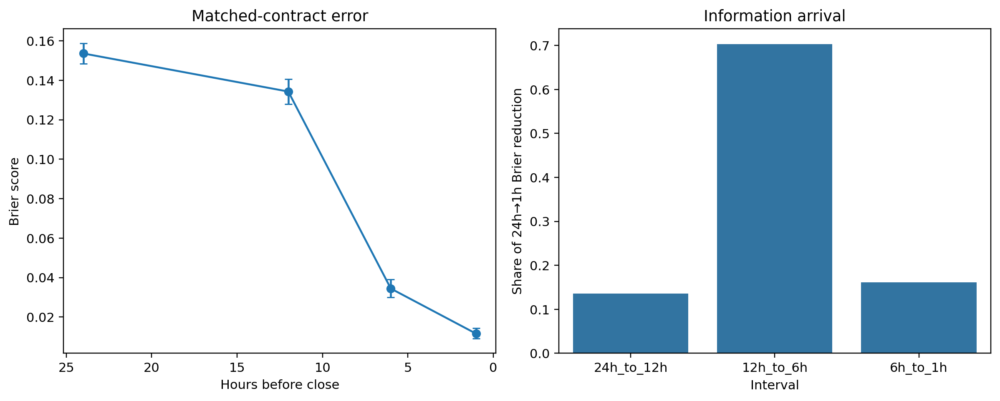
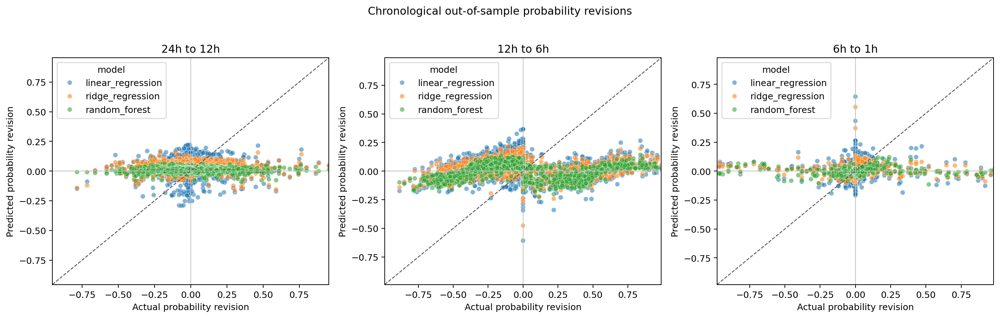

# Prediction Market Efficiency and Information Aggregation

An empirical study of Kalshi's `KXHIGHNY` daily New York City high-temperature markets.
The central question is:

> **Are Kalshi weather prediction-market probabilities calibrated, and are future
> probability revisions predictable from public market information?**

The project builds an auditable pipeline from versioned API responses to fixed-horizon
calibration tests, chronological out-of-sample efficiency models, and mechanism studies.
It is research software—not a trading system or investment advice.

## Results at a glance

The full-history sample spans **August 2021–June 2026** and contains **1,775 events**,
**9,040 resolved contracts**, and **219,294 hourly snapshots**.

- Market probabilities are broadly informative: contract-level Brier score falls from
  **0.136 at 24h** before close to **0.012 at 1h**, although calibration varies by horizon,
  probability range, and liquidity.
- Linear regression, ridge regression, and random forest all fail to beat a zero-revision
  benchmark on the final chronological test period. This is consistent with weak-form
  efficiency for the tested features; it does not prove that prices are martingales.
- On the balanced panel, **70.3% of the total 24h→1h Brier-score reduction occurs between
  12h and 6h** before close. That interval also has the highest trading rate,
  open-interest growth, and absolute probability revisions.
- Low-liquidity contracts have weaker late-stage calibration. At 6h and 1h, their Brier
  scores are roughly 2.6–2.7 times those of the highest-liquidity quartile.
- Extreme-temperature events do not show a detectable additional calibration penalty or
  revision predictability under the pre-specified definition.
- Archived ECMWF updates align with the timing of the market response, but update
  magnitudes do not explain the 12h→6h concentration. The evidence is correlational, not
  causal.





## Research design

### Calibration

For every binary temperature bucket, the pipeline selects the last two-sided quote at or
before 24h, 12h, 6h, and 1h prior to market close, subject to a two-hour staleness limit.
It reports Brier score, clipped log loss, fixed-decile reliability, and expected
calibration error. Confidence intervals resample whole event dates so mutually exclusive
contracts from the same day remain together.

### Efficiency

The efficiency null is

$$
E[p_{t+h}-p_t\mid\mathcal{F}_t]=0.
$$

Targets are paired midpoint revisions for 24h→12h, 12h→6h, and 6h→1h. Features include
the current midpoint, spread, volume, open interest, lagged revisions, volatility,
trailing volume, bucket label, and time to close. A single date-ordered 70/30 split keeps
the final 531 event dates untouched. Preprocessing is learned on training data only;
model losses are compared with zero revision using paired event-date block bootstraps and
Benjamini–Hochberg adjustment.

### Information arrival

A balanced 4,281-contract panel holds sample composition fixed across horizons. Follow-up
studies stratify calibration by point-in-time liquidity, decompose error reduction by
season and temperature regime, and compare market revisions with archived ECMWF forecast
runs and NOAA realized temperatures.

## Data and provenance

Kalshi hourly candles provide bid/ask quotes, trade prices, volume, and open interest.
Resolutions come from market metadata; the contracts settle against the National Weather
Service Daily Climate Report for Central Park. The canonical probability is the closing
YES bid/ask midpoint. Missing two-sided quotes remain missing rather than being replaced
with trades.

Every API run is immutable and includes retrieval metadata and SHA-256 hashes. Raw,
interim, and row-level processed data are intentionally excluded from Git because they
total hundreds of megabytes and can be regenerated. Publication figures and compact
summary tables are versioned. The archived weather extension is also fetched locally.

```text
Kalshi API responses + manifest
  └─ data/raw/
      └─ normalized markets, outcomes, and candles
          └─ data/interim/
              └─ fixed-horizon and efficiency panels
                  └─ data/processed/
                      └─ reports/tables/ + reports/figures/
```

## Repository structure

```text
config/                 Reproducible sample and model settings
scripts/                Executable research workflows
src/pm_efficiency/
  data/                 API clients, normalization, manifests, validation
  features/             Leakage-safe horizon and revision panels
  metrics/              Proper scores, calibration, and inference helpers
  models/               Chronological prediction and Bayesian extension
  analysis/             Calibration, efficiency, and mechanism studies
  visualization/        Shared plotting helpers
tests/                  Unit and simulation tests, including leakage checks
reports/                Final reports, compact tables, and figures
```

## Reproduce the study

Python 3.12 or newer is required.

```bash
python3 -m venv .venv
source .venv/bin/activate
python3 -m pip install -e '.[dev]'
python3 -m pytest -q
```

Run the core pipeline:

```bash
# 1. Fetch a new immutable Kalshi snapshot.
pm-efficiency fetch

# 2. Verify hashes, normalize records, and enforce data contracts.
pm-efficiency clean

# 3. Build canonical snapshots and leakage-safe panels.
pm-efficiency build

# 4. Generate descriptive, calibration, and efficiency outputs.
python3 scripts/descriptive_summary.py
python3 scripts/calibration_analysis.py
python3 scripts/efficiency_analysis.py

# 5. Generate conditional and information-arrival studies.
python3 scripts/conditional_studies.py
python3 scripts/information_source_analysis.py

# 6. Fetch/verify archived weather vintages and run the external comparison.
python3 scripts/weather_information_analysis.py --fetch
```

For a cached raw run, `pm-efficiency pipeline --run-dir <path>` reproduces the normalized
data, core panels, calibration tables, and efficiency outputs. `pm-efficiency analyze`
reruns the two primary analyses without fetching. Defaults are in `config/mvp.yaml`.

## Reports

- [Consolidated research report](reports/final_report.md)
- [Full-history and pilot comparison](reports/full_history_report.md)
- [Chronological efficiency tests](reports/efficiency_report.md)
- [Information-arrival decomposition](reports/information_arrival_report.md)
- [Liquidity-stratified calibration](reports/liquidity_report.md)
- [Extreme-weather robustness](reports/extreme_weather_report.md)
- [Activity and information-source mechanisms](reports/information_source_report.md)
- [Archived weather-update comparison](reports/weather_information_source_report.md)
- [Archived 90-day pilot audit](reports/pilot_calibration_report.md)

## Limitations

- Contract-level binary scores are not event-level multiclass scores; legacy contract sets
  are often incomplete and their midpoint sums need not represent exhaustive probability
  mass.
- Hourly candles blur within-hour sequencing and omit historical order-book depth.
- Midpoints are not executable prices; fees, slippage, market impact, and fill uncertainty
  are outside this study.
- Near-close coverage is selective, and contract design changes over the sample.
- ECMWF is an external benchmark, not the exact information set observed by every trader.
- Results from one weather series do not automatically generalize to other markets.

## References

- [Kalshi market-data quick start](https://docs.kalshi.com/getting_started/quick_start_market_data)
- [Kalshi historical-data guide](https://docs.kalshi.com/getting_started/historical_data)
- [Kalshi weather-market overview](https://help.kalshi.com/markets/popular-markets/weather-markets)
- [Open-Meteo Single Runs API](https://open-meteo.com/en/docs/single-runs-api)
- [NOAA NCEI Daily Summaries](https://www.ncei.noaa.gov/access/search/data-search/daily-summaries)
